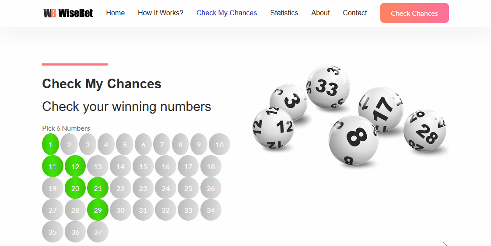

# WiseBet
WiseBet is a web application, built with .net and deployed to Microsoft Azure cloud (this is a project created at the end of 'Cloud Computing' course in Ort Braude college)
WiseBet shows real statistics of winning numbers from the Israeli Lotto. WiseBet allows it's members to choose their own numbers, and shows the chances of winning probabilities.

### Asp.net project built from scratch
Intended to show the lotto results, and let users pick their own numbers and check their chances of winning.
Deployed to Asure

Choose your lucky numbers, and get the changes of winning.

Showing statistics for each number

### Demo can be found at:
https://wise-bet.azurewebsites.net/
